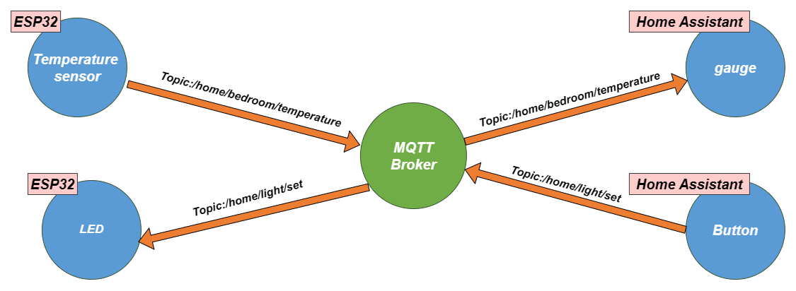

# Home Assistant IoT Project

This project demonstrates real-time monitoring and control using Home Assistant, an ESP32 microcontroller, and MQTT. 
The system monitors room temperature and controls an LED, with communication handled through an MQTT broker installed in Home Assistant.

  <!-- System image placeholder -->

## System Overview

In this setup:
- **ESP32 Temperature Sensor**: Publishes temperature data to the MQTT topic `/home/bedroom/temperature`. 
  Home Assistant subscribes to this topic and displays the temperature on a dashboard gauge.
- **ESP32 LED Control**: Subscribes to the MQTT topic `/home/light/set` to receive commands for turning the LED on or off. 
  Home Assistant sends these commands when a dashboard button is pressed.
- **Home Assistant MQTT Broker**: Manages communication between Home Assistant and the ESP32 devices.

The system uses a custom MQTT component programmed in the Arduino IDE, enabling the ESP32 to communicate with Home Assistant without ESPHome.

## Installation

1. **Set Up MQTT Broker in Home Assistant**:
   - Install the Mosquitto broker add-on in Home Assistant and start it.

2. **Program ESP32 Devices**:
   - Use the Arduino IDE to program the ESP32s with custom MQTT code.
   - Configure the temperature sensor ESP32 to publish to `/home/bedroom/temperature`.
   - Configure the LED ESP32 to listen for messages on `/home/light/set`.

3. **Configure Home Assistant Dashboard**:
   - Add a gauge to display temperature data and a button to control the LED.

## Demo

  <!-- Demo GIF placeholder -->

The GIF above demonstrates the system in action, showing real-time temperature updates and LED control via the Home Assistant dashboard.
